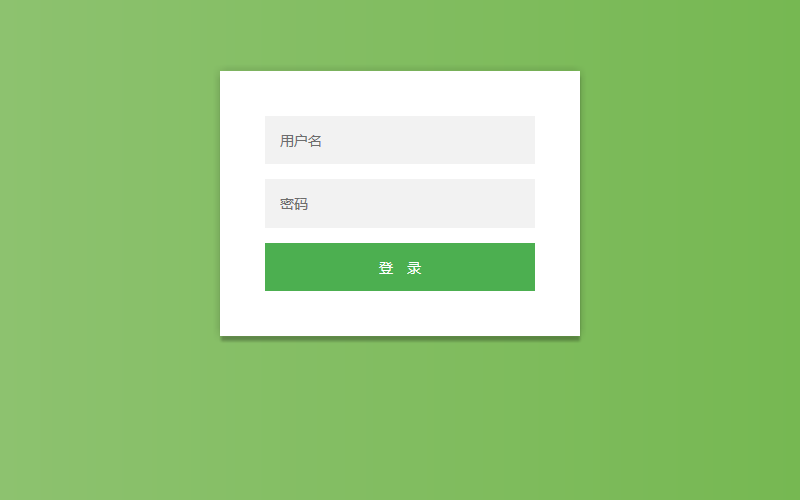
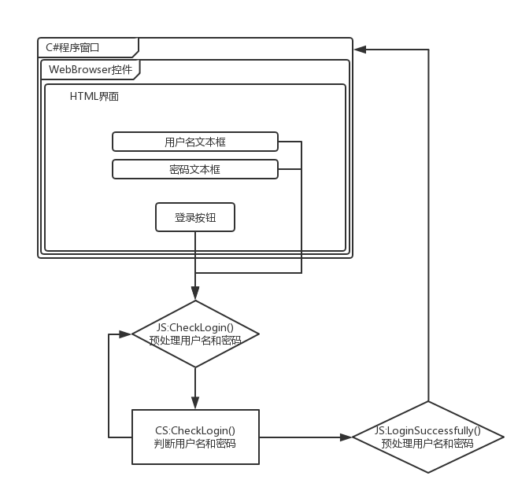

# CS_And_JS
实现Client内嵌Browser，并允许 CS 和 JS 代码互相通信和调用;

> ## 程序结构：

* 外壳为C#程序，Form内置WebBrowser控件用于显示HTML;
* 通过外壳C#代码和内置JS代码交互实现用户验证功能;

> ## 验证流程：

* 用户在HTML页面输入用户名和密码;
* 点击登录按钮，将用户名和密码作为参数调用C#代码;
* 由C#代码执行用户的验证逻辑，并决定是否调用JS的登陆成功代码();
* 而后程序控制权交回C#代码，以进行用户登录后的其他业务;

